<picture>
  <source media="(prefers-color-scheme: dark)" srcset="./assets/hero-dark.svg">
  <source media="(prefers-color-scheme: light)" srcset="./assets/hero-light.svg">
  
</picture>

 

🔧 Passionate about coding, problem-solving, and building cool projects.
🌱 Always learning and exploring new technologies.
💻 Working with multiple languages to build scalable applications.
📚 Open to collaboration and always looking to contribute to open-source!
💬 Let's connect! Feel free to check out my repositories, and don't hesitate to reach out!

<picture>
  <source media="(prefers-color-scheme: dark)" srcset="./assets/divider-dark.svg">
  <source media="(prefers-color-scheme: light)" srcset="./assets/divider-light.svg">
  
</picture>

## 🌐 Socials

<picture>
  <source media="(prefers-color-scheme: dark)" srcset="./assets/divider-dark.svg">
  <source media="(prefers-color-scheme: light)" srcset="./assets/divider-light.svg">
  
</picture>

## 💻 Tech Stack

**Languages**

**Web & Backend**

**Design**

**Databases**

**Data Science & Machine Learning**

**Version Control & DevOps**

**Hosting / SaaS**

**Servers**

<picture>
  <source media="(prefers-color-scheme: dark)" srcset="./assets/divider-dark.svg">
  <source media="(prefers-color-scheme: light)" srcset="./assets/divider-light.svg">
  
</picture>

## 📊 GitHub Stats

<code>LIGHTS OUT AND AWAY WE GO</code>

